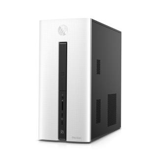
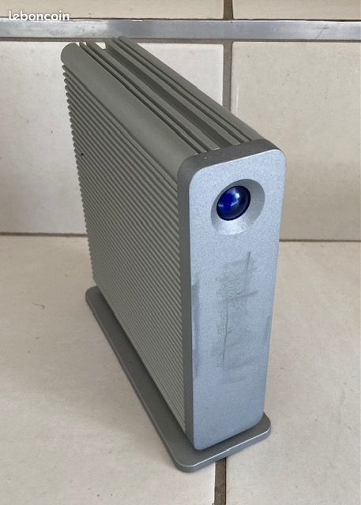

# Home Server
This project describes how I built  my  home server (NAS) running on Debian.

## Material

I used a HP tower on which I installed Debian 13

and LaCie hardDrives to store my videos once the server is operational.

